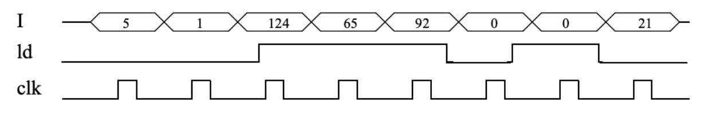
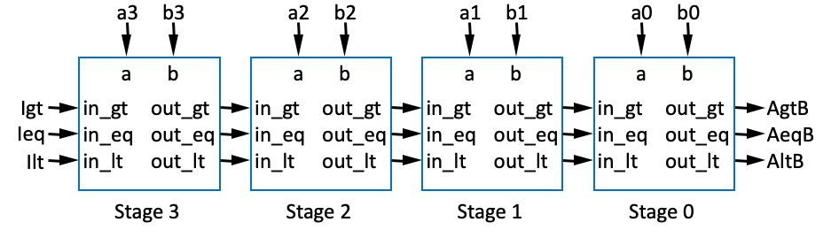

## (5 pts)
. Trace the behavior of an 8-bit parallel load register with 8-bit input I, 8-bit output Q, and load control input ld by completing the timing diagram in Figure below.

## (5 pts)
Design a 4-bit register with 2 control inputs s1 and s0, 4 data inputs I3, I2, I1 and I0, and 4 data outputs Q3, Q2, Q1 and Q0. When s1s0=00, the register maintains its value. When s1s0=01, the register loads I3..I0. When s1s0=10, the register clears itself to 0000. When s1s0=11, the register complements itself, so for example 0000 would become 1111, and 1010 would become 0101.

## (5 pts)
 Trace the values appearing at the outputs of a 3-bit carry-ripple adder for every onefull-adder-delay time period when adding 111 with 011. Assume all inputs were previously 0 for a long time.

## (5 pts)
Design a system that computes the sum of three 8-bit numbers using 8-bit carry-ripple adders.

## (5 pts)
Trace through the execution of the 4-bit magnitude comparator shown in Figure below when a=15 and b=12. Be sure to show how the comparisons propagate thought the individual comparators.

## (5 pts)
Convert the following **two’s complement** binary numbers to decimal numbers:  
- a. 00001111
- b. 10000000
- c. 10000001
- d. 11111111
- e. 10010101 

## (5 pts)
Using 4-bit subtractors, build a circuit that has three 8-bit inputs, A, B, and C, and a
single 8-bit output F, where F=(A-B)-C. 

## (5 pts)
Design an 8-bit shifter that shifts its inputs two bits to the right (shifting in 0s) when the shifter's shift control input is 1.

## (5 pts)
 Design a 4-bit up-counter with an additional output upper. upper outputs a 1 whenever the counter is within the upper half of the counter’s range, 8 to 15. Use a basic 4-bit up-counter as a building block.
